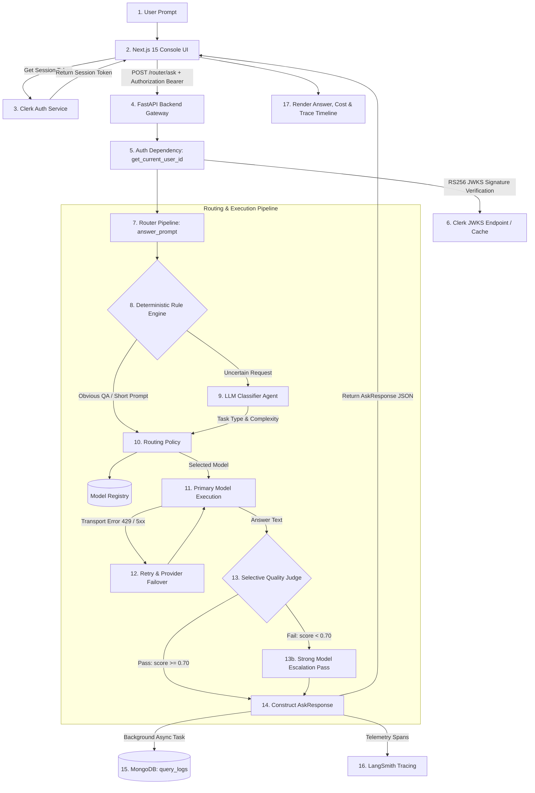

# System Architecture & Technical Specifications

> **Cost-Aware Multi-Model AI Router**

---

## 1. Overview

The **Cost-Aware Multi-Model AI Router** is an intelligent routing system designed to minimize LLM inference costs without compromising answer quality or application reliability.

### Core Objectives:
* **Cost Optimization:** Route simple or routine requests to fast, low-cost models rather than default state-of-the-art models.
* **Deterministic Rules First:** Skip expensive LLM classification calls for obvious prompts using a low-latency regex/heuristic rule engine.
* **Quality Preservation:** Evaluate answer quality with a selective quality judge and automatically escalate low-scoring responses to a stronger model.
* **High Availability & Reliability:** Handle provider rate limits (429) and outages (5xx) with automatic retries and capable provider failover.
* **Full Observability & Analytics:** Store execution history in MongoDB and trace end-to-end pipeline latency and token usage in LangSmith.

---

## 2. Technology Stack

The project relies strictly on the following stack:

| Layer | Technology / Library | Purpose in Repository |
| :--- | :--- | :--- |
| **Frontend Framework** | Next.js 15 (App Router), React 19, TypeScript | Interactive web console, history UI, analytics dashboard |
| **Styling** | Tailwind CSS | Custom styling and responsive UI design |
| **Backend Framework** | FastAPI 0.115+, Python 3.10+, Uvicorn | REST API backend, request validation, lifespan lifecycle |
| **Data Validation** | Pydantic v2, `pydantic-settings` | Strongly typed configuration and API schema validation |
| **Authentication** | Clerk (`@clerk/nextjs` v6), PyJWT, Cryptography | RS256 JWKS token verification & user session management |
| **Database** | MongoDB, Motor 3.3+ (Async), PyMongo 4.6+ | Asynchronous persistence for `query_logs` history & analytics |
| **LLM Adapters** | Groq, Mistral, Gemini, xAI, DeepSeek | Provider API integrations (`httpx` / official SDKs) |
| **Routing Engine** | Rule Engine (`rules/local`) + LLM Classifier Agent | Intent classification & cost-aware model selection policy |
| **Quality Evaluation** | Heuristic Judge (`evaluate_answer`) | Selective score evaluation and single-escalation gate |
| **Observability** | LangSmith SDK (`langsmith>=0.1`), `@traceable` | Tracing requests, model latency, and token consumption |
| **MCP Tooling** | Parallel Search MCP (`https://search.parallel.ai/mcp`) | Out-of-band pricing audit via `scripts/check_model_registry.py` |

---

## 3. High-Level Architecture

The diagram below represents the exact end-to-end request flow implemented in the codebase:

---

## 4. Backend Architecture

The backend code is modularly structured under `backend/app/`:

* **`app/main.py`:** FastAPI application initialization, CORS middleware (`frontend_origins`), lifecycle manager (`lifespan`) for MongoDB async connections, logging setup, and router registration.
* **`app/core/`:**
  * `config.py`: Central `Settings` class using `pydantic-settings` to load configuration from `backend/.env`.
  * `logging.py`: Structured application logging and `RequestLoggingMiddleware`.
  * `tracing.py`: Configures LangSmith tracing environment variables (`LANGCHAIN_TRACING_V2`, `LANGCHAIN_API_KEY`, `LANGCHAIN_PROJECT`).
* **`app/auth/`:**
  * `clerk.py`: Implements `verify_clerk_token()` using `PyJWT` and `cryptography` to fetch and cache Clerk RS256 JWKS public keys.
  * `dependencies.py`: Provides `get_current_user_id()` dependency supporting both Clerk tokens and local `cost-router` JWT tokens.
* **`app/models/registry.py`:** Static registry (`REGISTRY`) containing model specifications (`ModelSpec`), pricing (`input_cost_per_1k`, `output_cost_per_1k`), context limits, tier classification (`FAST` vs `STRONG`), and provider metadata for Groq, Mistral, and Gemini.
* **`app/router/`:**
  * `agent.py`: `classify_prompt()` runs deterministic regex/keyword rules (`rules/local`) or delegates to the classifier LLM.
  * `policy.py`: `route_decision()` selects the cheapest model matching task capabilities and maps complexity tiers.
  * `pipeline.py`: `answer_prompt()` orchestrates classification, routing, primary execution, evaluation, escalation, and cost breakdown.
  * `router.py`: Exposes FastAPI REST endpoints `/router/classify`, `/router/route`, and `/router/ask`.
* **`app/execution/`:** Standardized provider execution interface (`base.py`, `service.py`) and adapters for Groq, Mistral, Gemini, and OpenAI-compatible services.
* **`app/reliability/`:** Implements same-provider retries and provider failover logic for network/rate-limit exceptions.
* **`app/eval/`:** `evaluator.py` evaluates answer text against thresholds (`quality_pass_threshold = 0.70`).
* **`app/cost/calculator.py`:** Calculates `actual_cost`, `baseline_cost`, and `savings` per execution leg.
* **`app/db/` & `app/history/`:** Motor client wrapper (`mongo.py`), Pydantic document schemas (`schemas.py`), and background persistence service (`service.py`).
* **`app/analytics/`:** Serves aggregate routing analytics endpoints (`/analytics/summary`, `/analytics/timeseries`).

---

## 5. Frontend Architecture

The frontend is built with Next.js 15 App Router in `frontend/`:

* **Main Pages (`app/`):**
  * `/console` (`app/console/page.tsx`): Interactive prompt submission console with live execution timeline, answer display, cost breakdown, and reliability cards.
  * `/history` (`app/history/page.tsx`): Historical log viewer showing past user queries, selected models, costs, and quality scores.
  * `/analytics` (`app/analytics/page.tsx`): Analytics dashboard rendering total calls, cost savings, model distribution, and escalation charts.
  * `/connectors` (`app/connectors/page.tsx`): Status indicator page for LLM provider API connectors.
  * `/sign-in` & `/sign-up`: Clerk authentication pages.
* **Core Components (`components/`):**
  * `PromptCard.tsx`: User prompt input box with character validation.
  * `AnswerTrace.tsx` (`AnswerCard`, `TraceTimeline`): Renders Markdown response text and visual step-by-step stage trace.
  * `Panels.tsx` (`CostCard`, `ReliabilityCard`, `SummaryGrid`): Displays actual vs baseline costs, savings percentages, latency, tokens, and provider fallback status.
  * `RouterDetails.tsx`: Displays classification task type, complexity, and confidence score.
  * `Header.tsx` & `Shell.tsx`: Global navigation header, Clerk authentication buttons (`SignInButton`, `UserButton`).
* **API & Auth Client (`lib/`):**
  * `api.ts`: Wrapper for backend REST endpoints (`postAsk`, `getModels`, `getHistory`, `getAnalyticsSummary`). Automatically attaches Clerk Bearer tokens.
  * `ledger.ts`: Tracks local run counts and estimated cost savings in client `localStorage`.

---

## 6. Database Architecture

The application uses **MongoDB** (accessed via Motor async client).

* **Database Name:** `cost_aware_router` (configured via `MONGODB_DATABASE`).
* **Primary Collection:** `query_logs`

### Stored Fields (`QueryLogDocument` schema):

| Field Name | Type | Purpose |
| :--- | :--- | :--- |
| `request_id` | `str` | Unique 32-character hexadecimal UUID string. |
| `user_id` | `str` | Authenticated Clerk user ID (`sub` claim). |
| `prompt` | `str` | User input prompt string (filtered by privacy settings). |
| `answer` | `str` | Final generated model answer text. |
| `execution_trace` | `list[ExecutionStep]` | Array of stage execution trace steps (`stage`, `decision`, `details`). |
| `complexity_category` | `str` | Category assigned by classifier (`low`, `medium`, `high`). |
| `confidence_score` | `float` | Classifier confidence rating (0.0 to 1.0). |
| `initial_model` | `str` | Registry ID of the initial model selected by policy. |
| `final_model` | `str` | Registry ID of the model that served the final response. |
| `provider` | `str` | LLM provider name (e.g., `groq`, `mistral`, `gemini`). |
| `escalated` | `bool` | `True` if quality failure triggered strong-model escalation. |
| `passed` | `bool` | Quality verdict result (`True` if passed). |
| `quality_score` | `float \| None` | Score returned by quality judge (0.0 to 1.0). |
| `skipped_judge` | `bool` | `True` if quality evaluation was skipped by rules. |
| `routing_api_calls` | `int` | Number of LLM API calls used for classification (0 or 1). |
| `model_api_calls` | `int` | Number of LLM API calls used for answer generation (1 or 2). |
| `total_llm_api_calls` | `int` | Total LLM API calls for the request (`routing_api_calls + model_api_calls`). |
| `baseline_model` | `str` | Registry ID of strongest model used as baseline comparison. |
| `input_tokens` | `int` | Total prompt input tokens. |
| `output_tokens` | `int` | Total completion output tokens. |
| `total_tokens` | `int` | Combined input + output tokens. |
| `latency_ms` | `float` | Total end-to-end request latency in milliseconds. |
| `baseline_cost` | `float` | Cost in USD if baseline strong model was used. |
| `actual_cost` | `float` | Actual cost in USD accrued across all execution legs. |
| `cost_saved` | `float` | Dollars saved (`baseline_cost - actual_cost`). |
| `escalation_reason` | `str \| None` | Human-readable escalation reason ("quality gate failed", etc.). |
| `created_at` | `datetime` | UTC timestamp of document insertion. |

### Indexes (`setup_indexes()` in `app/db/mongo.py`):
1. `idx_unique_request_id`: Unique index on `request_id` (ASCENDING).
2. `idx_user_created`: Compound index on `user_id` (ASCENDING) + `created_at` (DESCENDING).
3. `idx_created_at`: Index on `created_at` (DESCENDING) for analytics.
4. `idx_final_model`: Index on `final_model` (ASCENDING).
5. `idx_passed`: Index on `passed` (ASCENDING).

---

## 7. External Services

1. **Clerk Authentication Service:** Manages user authentication and issues RS256 JWT tokens verified via Clerk's JWKS endpoint.
2. **Groq API:** Fast inference provider hosting models like `openai/gpt-oss-20b` (`groq-fast`) and `qwen/qwen3.6-27b` (`groq-strong`).
3. **Mistral AI API:** Inference provider hosting `mistral-small-latest` (`mistral-fast`) and `mistral-large-latest` (`mistral-strong`).
4. **Google Gemini API:** Inference provider hosting `gemini-3.6-flash` (`gemini-fast` & `gemini-strong`).
5. **MongoDB Atlas / Local MongoDB:** Persistent document store for query logs and analytics aggregations.
6. **LangSmith:** External observability platform for LLM execution tracing (`LANGCHAIN_API_KEY`).
7. **Parallel Search MCP:** External MCP endpoint (`https://search.parallel.ai/mcp`) called out-of-band by diagnostic script `scripts/check_model_registry.py` to check for provider price drift.
