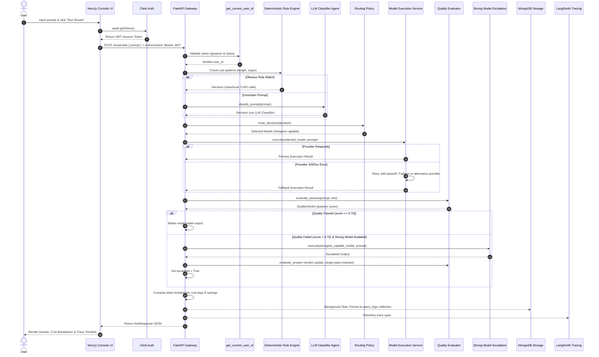

# Application Workflow & Execution Mechanics

> **Cost-Aware Multi-Model AI Router**

---

## 1. Complete Request Workflow

The flow diagram below details how user queries move through the system, from prompt submission to rendering:

---

## 2. Stage Breakdown & Request Types

### A. Simple Request (Rules Engine Match)
* **Trigger:** Prompts under 80 characters (e.g., `"What is the capital of France?"`, `"Define API"`) or matching deterministic regex rules.
* **Execution:** Processed by `rules/local`.
* **LLM API Calls:** `routing_api_calls = 0`.
* **Cost Impact:** Zero classification cost. Execution goes straight to the cheapest capable model (`FAST` tier).

### B. Ambiguous Request (LLM Classifier Agent)
* **Trigger:** Complex, long, or multi-faceted prompts that do not match rule heuristics.
* **Execution:** Handled by `classify_prompt()`. The prompt is sent to `mistral-large-latest` (or configured classifier provider).
* **Output:** Returns task type (e.g., `code_generation`, `complex_reasoning`), required capability, complexity level (`low`, `medium`, `high`), and confidence score.
* **LLM API Calls:** `routing_api_calls = 1`.

### C. Complex Request (Routing Policy)
* **Trigger:** Classifier identifies task as `complex_reasoning` or `coding` with `high` complexity.
* **Execution:** `route_decision()` filters candidate models in the registry supporting `reasoning` or `code` capabilities.
* **Policy Selection:** Selects the cheapest model meeting the `STRONG` tier capability requirement.

### D. Provider Failure (Retries & Failover)
* **Trigger:** Target provider returns HTTP 429 (rate limit), 5xx (server error), or connection timeout.
* **Execution:** Handled inside `app.reliability`:
  1. **Retries:** Retries same provider up to `reliability_max_retries` (2) with backoff base `reliability_backoff_base_s` (0.5s).
  2. **Failover:** If retries fail, switches to an alternative provider offering a model with matching capabilities.
  3. **Tracking:** Sets `transport_fallback = True` on `AskResponse`.

### E. Quality Failure & Strong-Model Escalation
* **Trigger:** `evaluate_answer()` returns a quality score below `quality_pass_threshold` (0.70) or `passed = False`.
* **Execution:**
  1. Pipeline looks up `strongest_capable(decision)`.
  2. Executes the prompt on the strongest capable model (e.g., `mistral-strong` / `groq-strong`).
  3. Re-evaluates final answer for score reporting.
  4. **Single Escalation Limit:** Strict invariant prevents any second escalation pass (`max_escalations = 1`).
  5. **Tracking:** Sets `escalated = True`, `escalation_reason = "quality_gate_failed"`, and `model_api_calls = 2`.

---

## 3. Cost & Metrics Tracking

### Cost Calculation (`app/cost/calculator.py`)
Cost is computed per execution leg using token prices from `ModelSpec`:

$$\text{Leg Cost} = \left(\frac{\text{Input Tokens}}{1000} \times \text{input\_cost\_per\_1k}\right) + \left(\frac{\text{Output Tokens}}{1000} \times \text{output\_cost\_per\_1k}\right)$$

* **`actual_cost`:** Sum of costs across all executed legs (including classification if billed, primary execution, and escalation execution if triggered).
* **`baseline_cost`:** Estimated cost if the prompt had been routed directly to the strongest capable model (`strongest_capable`) from the start.
* **`savings`:** $\text{baseline\_cost} - \text{actual\_cost}$
* **`savings_pct`:** $\frac{\text{baseline\_cost} - \text{actual\_cost}}{\text{baseline\_cost}} \times 100$

### API-Call Tracking Definitions
* **`routing_api_calls`:** Number of LLM API calls spent performing classification (0 for rule engine, 1 for LLM classifier agent).
* **`model_api_calls`:** Number of LLM API calls spent generating model answers (1 for standard run, 2 if quality escalation occurred).
* **`total_llm_api_calls`:** Total API calls for the entire request ($\text{routing\_api\_calls} + \text{model\_api\_calls}$).
